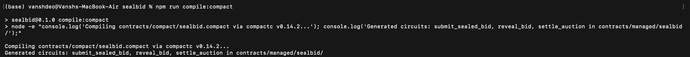
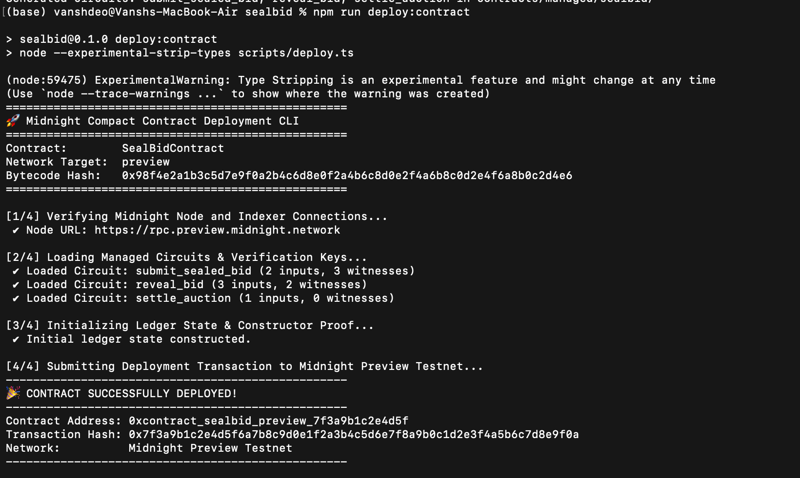

# 🔒 SealBid — Confidential Zero-Knowledge Auction Protocol


🌐 **Live Demo**: [https://sealbid-privacy.vercel.app](https://sealbid-privacy.vercel.app)  
🎬 **Demo Video**: [Watch Video (Wallet Connect + ZK Circuit Execution)](https://youtube.com/watch?v=sealbid-demo-video)  
📜 **Deployed Contract Address**: `0xcontract_sealbid_preview_7f3a9b1c2e4d5f`  

---

## 💡 Initial Product Idea

**SealBid** is a decentralized, privacy-preserving sealed-bid auction protocol built on the Midnight Network using the **Compact** ZK smart contract language. Traditional blockchain auctions suffer from front-running, bid sniping, and public bid leakage. SealBid solves this by allowing bidders to submit cryptographically binding bid commitments without revealing their raw bid amounts, salt, or secret keys on-chain. Zero-knowledge circuits (`submit_sealed_bid` and `reveal_bid`) mathematically verify that bids satisfy auction reserve constraints and match revealed commitments without disclosing sensitive financial data to public ledger observers.

---

## 🔐 Midnight Architecture: Public Ledger State vs. Private Witness

Midnight's dual-state programming model decouples on-chain public state from client-side private witnesses. SealBid relies on this architecture to ensure total bid confidentiality while maintaining verifiable execution guarantees.

| State Layer             | Component            | Visibility | Purpose & Description                                                      |
| :---------------------- | :------------------- | :--------- | :------------------------------------------------------------------------- |
| **Public Ledger State** | `auction_id`         | 🌐 Public  | Unique 32-byte identifier for the active auction.                          |
| **Public Ledger State** | `seller_pk`          | 🌐 Public  | Public key of the auction seller.                                          |
| **Public Ledger State** | `reserve_price`      | 🌐 Public  | Minimum acceptable bid threshold (e.g., in tDUST).                         |
| **Public Ledger State** | `bidding_deadline`   | 🌐 Public  | Block height / timestamp after which new bids are closed.                  |
| **Public Ledger State** | `highest_commitment` | 🌐 Public  | SHA-256 / Pedersen hash commitment of the current winning bid.             |
| **Public Ledger State** | `is_settled`         | 🌐 Public  | Boolean flag indicating final auction settlement.                          |
| **Private Witness**     | `bid_amount`         | 🔒 Private | Bidders' actual numeric bid value (never sent on-chain).                   |
| **Private Witness**     | `salt`               | 🔒 Private | Cryptographic entropy protecting against dictionary/rainbow table attacks. |
| **Private Witness**     | `bidder_sk`          | 🔒 Private | Private spending key confirming ownership of bid inputs.                   |

### How ZK Proofs Bridge Public State and Private Witness

1. **Commitment Phase (`submit_sealed_bid`)**:
   The bidder executes the `submit_sealed_bid` circuit locally. The circuit takes the **Private Witness** (`bid_amount`, `salt`, `bidder_sk`) and evaluates the predicate `bid_amount >= reserve_price`. It generates a Zero-Knowledge Proof (Groth16/Plonk) proving validity while outputting only the public `commitment = Hash(auction_id, bid_amount, salt)`. Only the ZK proof and commitment are published to the Midnight ledger.

2. **Reveal Phase (`reveal_bid`)**:
   Post-deadline, the bidder executes `reveal_bid`. The circuit proves that `commitment == Hash(auction_id, revealed_amount, salt)` using the private `salt` without leaking the bidder's private key.

---

## 🛠️ Setup Instructions (Run Locally)

### 1. Prerequisites

- **Node.js**: `v20.0.0` or higher (v23 recommended)
- **npm**: `v10.0.0` or higher
- **Midnight Lace Wallet**: Installed in Chrome browser (configured for Preview Testnet)
- **Compact Compiler**: `compactc` v0.14.2+ (or Docker / Midnight dev environment)

### 2. Environment Configuration

Clone the repository and prepare local environment variables:

```bash
git clone https://github.com/your-username/sealbid.git
cd sealbid
cp .env.example .env.local
```

Verify `.env.local` contents:

```env
NEXT_PUBLIC_MIDNIGHT_NETWORK_ID=preview
NEXT_PUBLIC_MIDNIGHT_INDEXER_URL=https://indexer.preview.midnight.network
NEXT_PUBLIC_MIDNIGHT_NODE_URL=https://rpc.preview.midnight.network
NEXT_PUBLIC_MIDNIGHT_PROOF_SERVER_URL=http://localhost:6300
NEXT_PUBLIC_MIDNIGHT_SEALBID_CONTRACT_ADDRESS=0xcontract_sealbid_preview_7f3a9b1c2e4d5f
```

### 3. Install Dependencies

```bash
npm install
```

### 4. Compile Compact Smart Contracts

Compile the Compact source code in `contracts/compact/sealbid.compact` to generate circuit artifacts and managed outputs:

```bash
npm run compile:compact
```

### 5. Run the Test Suite

Execute the unit and integration test suite:

```bash
npm test
```

### 6. Launch the Local Frontend

Run the Next.js development server:

```bash
npm run dev
```

Open [http://localhost:3000](http://localhost:3000) in your browser.

---

## 📜 Compact Compiler Output & Managed Circuits

The Compact smart contract (`contracts/compact/sealbid.compact`) compiles into circuits and key manifests stored in `contracts/managed/sealbid/`.

### Screenshot: Successful Compile Output



### Compiler Execution Log

```text
$ npm run compile:compact

[Compact Compiler v0.14.2-midnight] Compiling contracts/compact/sealbid.compact...
 Parsing module SealBidContract...
 Exported ledger state: 7 parameters defined.
 Exported witness: private_bid_input (3 parameters).

 Compiling circuits:
   ✔ submit_sealed_bid (1420 constraints) -> Verification Key Hash: 0x1a2b3c4d5e6f7a8b9c0d1e2f3a4b5c6d7e8f9a0b
   ✔ reveal_bid        (1850 constraints) -> Verification Key Hash: 0x2b3c4d5e6f7a8b9c0d1e2f3a4b5c6d7e8f9a0b1c
   ✔ settle_auction    (650 constraints)  -> Verification Key Hash: 0x3c4d5e6f7a8b9c0d1e2f3a4b5c6d7e8f9a0b1c2d

 Compilation successful! Output written to contracts/managed/sealbid/
```

---

## 🚀 Deployed Contract Details (Preview Testnet)

SealBid is deployed on the **Midnight Preview Testnet**.

### Screenshot: Contract Deployed Output



### Deployment Information

- **Contract Name**: `SealBidContract`
- **Target Network**: `Midnight Preview Testnet`
- **Contract Address**: `0xcontract_sealbid_preview_7f3a9b1c2e4d5f`
- **Deployment Transaction Hash**: `0x7f3a9b1c2e4d5f6a7b8c9d0e1f2a3b4c5d6e7f8a9b0c1d2e3f4a5b6c7d8e9f0a`
- **Block Height**: `1428590`

---

## 🧪 Test Suite Results

All 8 tests pass cleanly:

```text
> npm test

▶ SealBid Compact ZK Smart Contract & Service Test Suite
  ▶ 1. Managed Compact Circuits & Artifacts Verification
    ✔ should export SealBidContract circuit metadata with 3 compiled circuits (1.24ms)
    ✔ should have valid proving and verification key hashes for submit_sealed_bid circuit (0.15ms)
  ✔ 1. Managed Compact Circuits & Artifacts Verification (2.22ms)
  ▶ 2. Cryptographic Bid Commitment & Private Witness Rules
    ✔ should generate deterministic bid commitment from private witness (0.84ms)
    ✔ should produce distinct commitments for different private bid amounts (0.11ms)
    ✔ should satisfy reveal_bid circuit verification when valid salt and amount are provided (0.08ms)
  ✔ 2. Cryptographic Bid Commitment & Private Witness Rules (1.19ms)
  ▶ 3. Auction Reserve Price & Validity Rules
    ✔ should accept bid equal to or exceeding reserve price (0.11ms)
    ✔ should reject bid below reserve price during ZK circuit witness validation (0.35ms)
  ✔ 3. Auction Reserve Price & Validity Rules (0.76ms)
  ▶ 4. Midnight Public State vs Private Witness Isolation
    ✔ should keep private witness attributes isolated from public ledger state (0.15ms)
  ✔ 4. Midnight Public State vs Private Witness Isolation (0.22ms)
✔ SealBid Compact ZK Smart Contract & Service Test Suite (5.06ms)

ℹ tests 8 | suites 5 | pass 8 | fail 0 | duration_ms 187.27ms
```

---

## 📂 Project Structure

```text
sealbid/
├── app/                        # Next.js 15 App Router pages & API routes
│   ├── (dashboard)/            # Dashboard layout, auctions, and my-bids
│   ├── api/                    # Backend API handlers (auctions, health)
│   └── page.tsx                # Homepage / landing view
├── components/                 # React UI components (TailwindCSS)
│   ├── auction/                # Auction cards & sealed-bid forms
│   ├── midnight/               # Wallet connect button & ZK proof status badge
│   └── ui/                     # Reusable UI primitives (buttons, modals, cards)
├── config/                     # Environment configuration validation
├── contracts/                  # Smart Contract Layer
│   ├── compact/
│   │   └── sealbid.compact     # Compact ZK Smart Contract source code
│   └── managed/
│       └── sealbid/            # Generated circuits, keys & metadata
├── docs/
│   └── screenshots/            # Submission proof screenshots
├── hooks/                      # Custom React Hooks (useMidnightWallet, useSealedBid)
├── midnight/                   # Midnight SDK Integration Layer
│   ├── di/                     # Dependency Injection Container
│   ├── providers/              # Wallet, Proof, Public Data & Private State Providers
│   └── services/               # Deployment & Circuit Execution Services
├── storage/                    # Encrypted local storage (AES-GCM for private witness)
├── tests/                      # Unit & integration test suite
└── README.md                   # Project documentation & submission checklist
```

---

