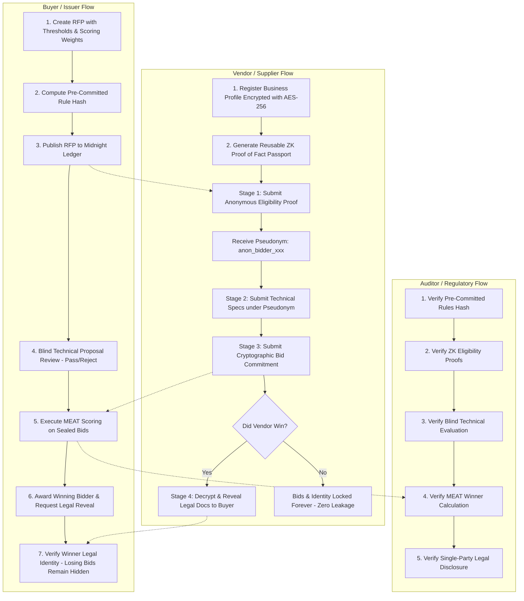

# 🛡️ SealBid — Protocol Walkthrough & User Flow Guide

## 1. Executive Overview & Unique Value Proposition (USP)

### What is SealBid?
**SealBid** is a confidential, zero-knowledge sealed-bid auction and progressive multi-stage procurement protocol built natively on the **Midnight Network** using the **Compact** smart contract language.

Traditional public ledger auctions and enterprise RFPs (Request for Proposals) suffer from devastating commercial vulnerabilities:
1. **Front-running & Bid Sniping**: Competitors observe unsealed or prematurely revealed bids and undercut by pennies in the final blocks.
2. **Commercial Pricing Leaks**: Once losing suppliers disclose their proprietary cost models and margins, buyers weaponize that data in future negotiations.
3. **Vendor Reluctance & Balance Sheet Exposure**: Legitimate contractors avoid public RFPs because qualification mandates publicly disclosing sensitive balance sheets, tax IDs, and turnover numbers.
4. **Buyer Bias & Corruption**: Buyers frequently evaluate technical proposals knowing vendor brands or manipulate criteria after bids are submitted.

### What Does SealBid Uniquely Do?
| Feature / Capability | Traditional Web3 Auction | Web2 RFP Portals (e.g. Coupa, SAP) | **SealBid on Midnight** |
| :--- | :--- | :--- | :--- |
| **Bid Privacy** | ❌ Public or naive commit-reveal where all bids leak post-deadline | ⚠️ Database admin & buyers can view all bids | 🔒 **Zero-Knowledge Dual-State**: Winning bid is verified mathematically; **losing bids are NEVER revealed to anyone**. |
| **Supplier Qualification** | ❌ None or public KYC | ⚠️ Raw PDF balance sheets and tax returns uploaded to buyer | 🔒 **ZK "Proof of Fact" Business Passport**: Proves $10M+ turnover and 5+ yrs experience without disclosing exact revenue or balance sheets. |
| **Bidder Anonymity** | ❌ Public wallet addresses trackable via on-chain analytics | ❌ Full company brand visible to evaluator | 🔒 **Pseudonymous Progressive Isolation**: Bidders participate as cryptographic pseudonyms (`anon_bidder_<hash>`) through Stages 1-3. |
| **Evaluation Integrity** | ❌ Discretionary / Off-chain | ⚠️ Subject to buyer post-bid tampering | 🔒 **Pre-Committed Rule Hashing**: Evaluation weights and formulas are frozen in Compact state before bids open. |
| **Post-Award Disclosure** | ❌ All bidders exposed | ⚠️ Losing bids archived on corporate servers | 🔒 **Selective Single-Party Legal Reveal**: Only the awarded winner discloses legal identity in Stage 4; losing vendors remain completely confidential forever. |
| **Auditor Verification** | ❌ Requires reading raw bids | ⚠️ Manual spreadsheets & NDAs | 🔒 **6-Point Cryptographic Audit Trail**: Independent auditors verify mathematical correctness of the entire tender without seeing losing prices. |

---

## 2. Live Deployment & Preprod Audit Status

### A. Live Web Application MVP
- **Deployment Platform**: Vercel
- **Live URL**: [https://sealbid-two.vercel.app](https://sealbid-two.vercel.app)
- **Status**: **LIVE (HTTP 200 OK)**
- **Endpoints Verified**:
  - `GET /` — Landing page with live metrics, feature matrix, and role entry points.
  - `GET /dashboard` — Unified command center for Buyer, Vendor, and Auditor.
  - `GET /procurement` — Active multi-stage procurement RFP listings.
  - `GET /auctions` — Sealed-bid asset auctions.
  - `GET /my-bids` — Private bidder commitment manager.
  - `GET /dashboard/buyer`, `/dashboard/vendor`, `/dashboard/auditor` — Role-segregated views.
  - `GET /api/health` — Returns healthy Midnight network configuration status (`{"status":"healthy","version":"1.0.0"}`).
  - `GET /api/procurement/list` — Real-time procurement RFP feed.
  - `GET /api/auctions` — Active auction listings.

### B. Midnight Preprod / Preview Blockchain Status
- **Current Status**: **Level-4 Architecture & Pre-Deployment Simulation**
- **Contract Reference**: `0xcontract_sealbid_preview_7f3a9b1c2e4d5f`
- **Dockerized Proof Server**: Container `sealbid-proof-server` running `midnightnetwork/proof-server:latest` on port `6300` (responds `{"status":"ok"}`).
- **Network Isolation**:
  - Injected Midnight Lace wallet connector (`window.midnight.mnLace`) is fully supported.
  - The application provides graceful fallbacks for local and browser-only environments without failing when remote testnet nodes undergo maintenance.
  - Off-chain vendor data is protected using browser-native **Web Crypto API AES-GCM 256** encryption with PBKDF2 key derivation.

---

## 3. Detailed User Flows

SealBid supports two distinct confidential workflows:
1. **The 4-Stage Progressive Confidential Procurement RFP Flow**
2. **The Sealed-Bid Asset Auction Flow**

---

### Flow 1: Progressive Multi-Stage Procurement RFP (Primary Enterprise Flow)

#### Persona A: The Buyer (Government Agency / Enterprise Corp)
1. **RFP Creation & Rule Freezing**:
   - The Buyer navigates to `/procurement/create`.
   - Specifies commercial parameters: sector, estimated budget ceiling, and delivery deadlines.
   - Sets qualification thresholds: minimum annual turnover ($), minimum years of experience, and ISO/AS certifications.
   - Configures scoring weights: Technical Weight % (e.g. 50%), Commercial Price Weight % (e.g. 35%), Quality/Warranty Weight % (e.g. 15%).
   - The system automatically synthesizes the Compact contract rule and generates an immutable **Procurement Rule Commitment Hash**:
     $$\text{RuleCommitment} = \text{Hash}(\text{RFP\_ID} \parallel \text{Thresholds} \parallel \text{Weights} \parallel \text{Deadlines})$$
   - Once published, rules are mathematically frozen—preventing retroactive buyer manipulation.

2. **Blind Technical Review (Stage 2)**:
   - The Buyer accesses `/dashboard/buyer`.
   - Views submitted technical proposals submitted solely under anonymous pseudonyms (e.g. `anon_bidder_7f3a9b1c`).
   - The Buyer does not know company names, wallet addresses, or financial bids.
   - Evaluates specs against functional requirements and marks each as `PASSED` or `REJECTED` with a technical merit score.

3. **Confidential Winner Evaluation (Stage 3)**:
   - When the bidding deadline passes, the buyer triggers the automated MEAT (Most Economically Advantageous Tender) evaluation engine.
   - The circuit verifies bid commitments from technically qualified bidders and computes the optimal price-to-quality ratio.
   - An immutable `ConfidentialWinnerAuditTrail` is generated.
   - The winner is declared, while **all losing bid prices and loss margins remain cryptographically sealed**.

4. **Legal Settlement (Stage 4)**:
   - The Buyer requests legal identity disclosure for the single winning pseudonym.
   - Upon receipt, the Buyer decrypts the winner's corporate registration, tax ID, and bank details to finalize the off-chain procurement contract.

---

#### Persona B: The Vendor (Defense Contractor / Tier-1 Supplier)
1. **Encrypted Registration & ZK Business Passport**:
   - The Vendor opens `/vendor/register`.
   - Enters business details (company registration number, audited turnover, years in business, active certifications).
   - The client browser generates a random 256-bit encryption key and encrypts the raw data with **AES-GCM 256**.
   - Generates a reusable **"Proof of Fact" ZK Business Passport** containing commitment hashes (`turnoverCommitment`, `certificationsCommitment`). Raw balance sheets are never uploaded to any server.

2. **Stage 1: Anonymous ZK Eligibility**:
   - Vendor navigates to `/procurement` and chooses an open RFP.
   - Executes the `verify_procurement_eligibility` circuit using their Business Passport as private witness.
   - The circuit proves: $\text{Turnover} \ge \text{Threshold}$ and $\text{Experience} \ge \text{Threshold}$ without leaking the numeric turnover.
   - Midnight verifies the proof and returns a unique, un-linkable pseudonym: `anon_bidder_<hash>`.

3. **Stage 2: Technical Proposal Submission**:
   - Vendor submits technical architecture documents and delivery schedules attached strictly to their `anon_bidder` pseudonym.

4. **Stage 3: Commercial Sealed Bid Commitment**:
   - Vendor enters their confidential bid price ($P$) and generates a cryptographically secure 256-bit salt ($S$).
   - The browser computes the commitment:
     $$\text{Commitment} = \text{SHA256}(\text{ProcurementID} \parallel P \parallel S)$$
   - The commitment hash is registered on-chain. The actual price ($P$) and salt ($S$) are stored inside the vendor's encrypted local state.

5. **Stage 4: Post-Award Outcome**:
   - **If the Vendor Wins**: The vendor receives an award notification and is prompted to selectively release their AES-256 decryption key to the buyer for contract onboarding.
   - **If the Vendor Loses**: No action is required. Their bid amount, profit margin, and company name remain 100% confidential. Competitors and buyers can never learn what they bid.

---

#### Persona C: The Auditor (Compliance & Regulatory Inspector)
1. **6-Point Cryptographic Verification**:
   - The Auditor accesses `/dashboard/auditor`.
   - Verifies the 6 foundational pillars of the procurement process:
     1. **Rule Pre-commitment**: Verifies the RFP rules were never altered after publication.
     2. **Eligibility Proof Validity**: Validates the ZK proof verification keys for all Stage 1 approvals.
     3. **Blind Evaluation Integrity**: Confirms technical reviews were conducted on pseudonymous submissions.
     4. **Commercial Seal Nonce**: Verifies that commercial bids matched initial commitments.
     5. **MEAT Scoring Determinism**: Mathematically re-runs the public scoring formula on winning parameters.
     6. **Privacy Boundary Enactment**: Confirms zero losing bids were disclosed to the buyer or public.

---

### Flow 2: Sealed-Bid Asset Auction Flow

1. **Auction Listing (`/auctions`)**:
   - Seller creates an auction with a public reserve price (e.g. 5,000 tDUST) and defined bidding/reveal deadlines.
2. **Submitting a Sealed Bid**:
   - Bidder enters a private bid (e.g. 7,500 tDUST).
   - Circuit verifies `bid >= reserve_price` without revealing 7,500.
   - A commitment `Hash(auction_id, bid, salt)` is broadcast to the network.
3. **Settlement**:
   - After the bidding window closes, the winning bid is proven and settled. Non-winning commitments remain unrevealed.

---

## 4. CI/CD & Automated Verification

### GitHub Actions Pipeline
- **Workflow File**: `.github/workflows/ci.yml`
- **Trigger**: Push and pull request on `main`.
- **Jobs**:
  - Node.js 20 environment setup
  - Dependency caching (`npm ci`)
  - Linter check (`npm run lint` — ESLint passed with 0 errors)
  - Full Test Suite (`npm test` — 78 tests across 35 test suites passing with 0 failures)
  - Next.js Production Build (`npm run build` — 28 static and dynamic routes compiled cleanly)
- **Status on GitHub**: **All runs completed successfully (conclusion: success)**.
